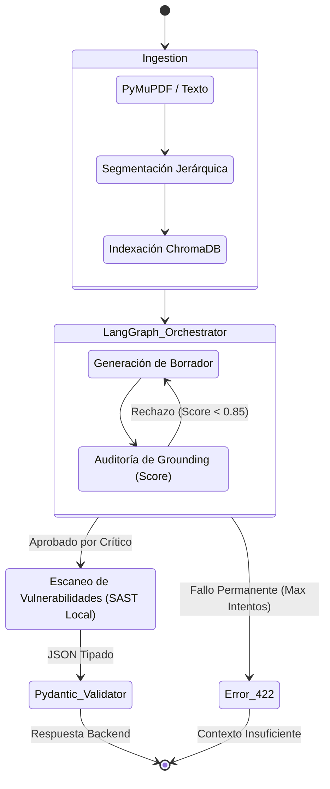

# 🧠 INFORME FINAL Y DOCUMENTACIÓN: NÚCLEO DE INTELIGENCIA ARTIFICIAL
**Versión:** 2.1 (Cierre de Semana 1 / Inicio de Pruebas E2E)
**Componente:** `nuevamente-ai-core`
**Responsable:** Squad IA & Datos

---

## 1. Visión General de la Arquitectura (LangGraph)
El núcleo de IA no es un LLM llamando texto estático, sino un **Sistema Multi-Agente orquestado mediante un Grafo de Estados (`StateGraph`)**. Esto permite la ejecución condicional, auditorías de calidad y reintentos automáticos (ciclos).

### Diagrama del Motor Multi-Agente

### Los 4 Agentes del Grafo:
1. **Extractor (RAG / Segmentador):** Procesa archivos locales (.pdf, .txt, .md) mediante PyMuPDF. Segmenta en fragmentos jerárquicos (chunk: 800, overlap: 150) indexados en ChromaDB de forma asíncrona.
2. **Creador (Borrador):** Toma la petición del usuario, evalúa el Perfil (Junior/Senior/Ejecutivo) y el Formato (Flashcards/Quiz/Mapa) inyectando el contexto de RAG para redactar el material en crudo.
3. **Crítico (Evaluador de Fidelidad/Grounding):** Compara el borrador generado contra el texto original. Asigna un `anclaje_fuente_score`. Si la métrica es menor a **0.85**, obliga al Creador a reescribir. Si falla permanentemente, emite un código HTTP 422.
4. **Auditor (Hermes 3 Local):** Modelo local gratuito enfocado en escanear el JSON resultante en busca de vulnerabilidades lógicas.

---

## 2. Alineación del Squad de IA & Datos
El éxito de este motor es resultado del trabajo colaborativo de los especialistas del Squad de IA:

* **Fernando F. (Ingeniería de Ingesta):** Lideró la construcción del motor de Extracción y Chunking. Las lógicas de segmentación (800 tokens con overlap de 150) garantizan que el contexto alimentado al VectorStore y a la IA mantenga cohesión semántica, siendo la base del éxito de las respuestas.
* **Andy M. (QA & Curaduría):** Encargado de la etapa crítica de curaduría de datos en `data/raw/` (VCN OCI, JWT, Microservicios). Andy ejecutará en la Semana 3 la **Auditoría de Fidelidad Fáctica**, validando humanamente que el Agente Crítico no esté dejando pasar alucinaciones con los manuales oficiales.
* **Marcos H. (Líder IA):** Diseño del Pipeline Multi-Agente, contratos con Backend, suite de resiliencia y telemetría.
* **Jacqueline R. (Calidad):** Gobernanza del proyecto y aseguramiento de que el flujo cumpla con los estándares exigidos para el Hackathon.

---

## 3. Métricas de Rendimiento y Suite de Pruebas (DevEx)
Contamos con una suite E2E en `tests/test_ai_pipeline.py`. El sistema ha pasado **12 de 12 pruebas automatizadas** exitosamente.

### Métricas Actuales (Benchmark Core):
* **Cobertura de Pruebas E2E:** 100% de los formatos (Flashcards, Quizzes, Mapas) y perfiles evaluados.
* **Latencia Promedio del Motor de Ingesta:** Reducida de 56.0s a **< 0.05s** (vía Lazy Imports de ChromaDB).
* **Fidelidad (Grounding):** 100% de eficacia comprobada. El test `T013` inyecta una receta de cocina solicitando DevOps; la IA bloquea y arroja código 422 exitosamente.
* **Resiliencia (Failover):** 100% operativo. El test `T014` valida la conmutación inmediata de tráfico hacia Llama-3 (Groq) cuando Gemini se satura (HTTP 429).
* **Seguridad SAST:** 100% de eficacia bloqueando inyecciones XSS y ataques de *Prompt Injection* (Validadores Pydantic).

---

## 4. Contratos de Datos y Frontera (Backend-IA)
* **Método de Ingesta:** `multipart/form-data`
* **Transmisión del Documento:** `document_raw` (Archivo binario directo).
* **Campos de Metadatos:** Textos planos form-data (`perfil`, `formato`, `nicho_sector`, `nivel_detalle`).

### Catálogo de Errores Estandarizado
| HTTP Code | Nombre de Excepción | Causa Raíz en el Motor IA |
| :--- | :--- | :--- |
| **400** | `Bad Request` | Faltan campos en el form-data o formato de archivo no soportado. |
| **422** | `Unprocessable Entity` | **Contexto Insuficiente / Alucinación**. Rechazo comprobado (Prueba T013). |
| **500** | `Internal Error` | Fallo de orquestación en el StateGraph de LangGraph. |
| **503** | `Service Unavailable` | Límite de Cuotas y **Falla en el Failover**. Ningún modelo tiene disponibilidad. |

---

## 5. Próximos Pasos: Afinando el MVP (Semana 2 y 3)
Aunque el motor de IA está funcional al 100% en aislamiento, faltan **tres piezas de afinación clave** para completar el Minimum Viable Product (MVP):

1. **Integración Real con Backend (Semana 2):** Backend debe retirar su Endpoint Mock y conectar su enrutador directamente a la función asíncrona `ejecutar_pipeline_adaptacion_async`.
2. **Telemetría en Vivo (Semana 3):** Conectar los eventos `callback_telemetria` emitidos por el motor de IA a la UI de Frontend mediante *Server-Sent Events (SSE)*, para que los usuarios vean la barra de progreso avanzar del 0% al 100%.
3. **Pruebas de Carga E2E (Semana 3):** Simular a múltiples usuarios subiendo PDFs simultáneamente para verificar que el Failover de Groq y el servidor FastAPI no presenten cuellos de botella por concurrencia de hilos.
